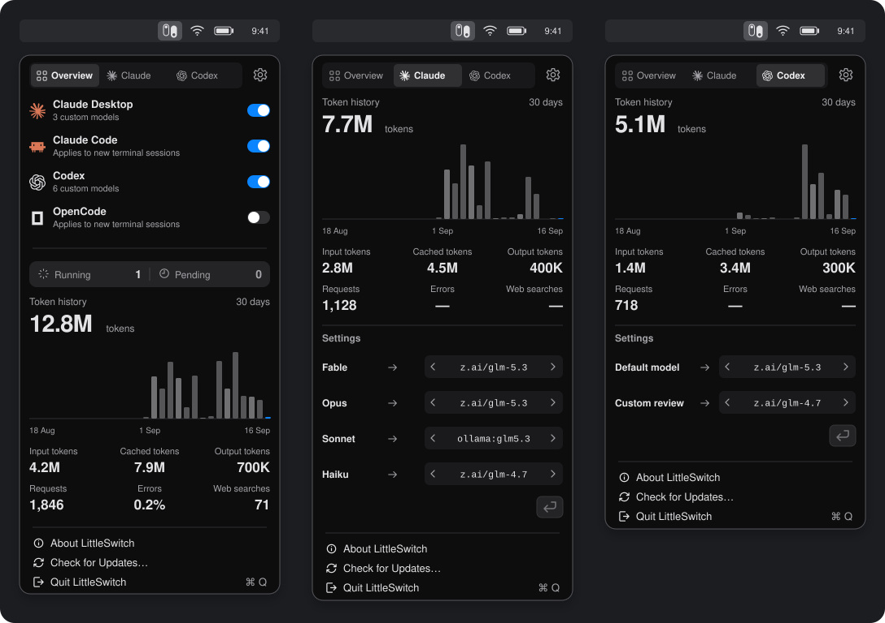

# LittleSwitch

A native macOS menu-bar app that routes **Claude Desktop**, **Claude Code**, **Codex**, and **OpenCode** to the model provider of your choice: Ollama, vLLM, z.ai, or any Anthropic-compatible gateway.

[**Download for macOS**](https://github.com/alfred-labs/little-switch/releases/latest) · [Quick start](#quick-start) · [Build from source](DEVELOPER.md)

<picture>
  <source media="(max-width: 800px)" srcset="assets/readme/menu-bar-mobile.svg">
  
</picture>

Overview, Claude, and Codex — right in your menu bar. Mockups with illustrative usage data.

A local gateway on `127.0.0.1:11436` speaks Anthropic Messages and OpenAI Responses natively. Data stays on your Mac unless you point it elsewhere.

Each Claude route (Fable 5, Opus 5, Sonnet 5, Haiku 4.5, Sonnet 4.6) maps independently to any model discovered from a connected provider. Catalogues are read from `<baseURL>/v1/models`, and Ollama, vLLM, z.ai, and compatible backends all use the same standard path.

## Features

- **Anthropic Messages & SSE proxy** with tool-declaration validation, portable history replay, and targeted initial-usage normalization when a provider starts at zero.
- **Independent `provider/model` mapping** for each of the five Claude routes.
- **Local or remote providers**, with optional Bearer or `X-Api-Key` authentication.
- **Context window detection** with Ollama enrichment and manual per-model override.
- **Secrets stored exclusively in the macOS Keychain**, separate from config files.
- **Bounded image-retry** when a model lacks image support, replayed once on the same provider.
- **Transactional Claude third-party profile**, applied and restored atomically.
- **Independent Codex and OpenCode profiles** with external-change detection.
- **Native SwiftUI/AppKit interface**, built directly against AppKit and SwiftUI.
- **Live native traffic log** with full requests, responses, and SSE frames, stored locally with bounded rotation.
- **Per-provider FIFO queue** shared across Claude Desktop, Claude Code, Codex, and OpenCode, with a configurable parallel limit and live activity in Settings and the menu bar.
- **Session token counter**, local `count_tokens` endpoint, and provider initial estimation with local `/4` fallback.
- **Web search relay** for Claude and OpenAI Responses to Firecrawl (Cloud), Tavily, Brave, or Exa, with no extra process.
- **Client-side tool discovery**: Claude's `ToolSearch` preserved and OpenAI's `tool_search` with `execution: "client"` adapted in JSON and SSE.

## Quick start

Download the latest DMG from [Releases](https://github.com/alfred-labs/little-switch/releases) or build from source (see [DEVELOPER.md](DEVELOPER.md)).

The repository tooling ships as a [standalone Swift package](tools/README.md).
Verification, release, and diagnostic workflows run through mise, with no
dependency on Node/npm or Python. `mise.lock` pins SwiftLint and Periphery
for macOS ARM64. Swift comes from Xcode.
The [architecture map](docs/architecture.md) describes the Core, UI, Search,
and Transport domains.

1. Open **Settings → Providers** and add Ollama, vLLM, z.ai, or a compatible provider. `Test & Save` must succeed on `/v1/models`. Reopen the provider to verify the detected context window, or enter an override (e.g. `400k`, `1m`) when it isn't published.
2. In **Claude**, choose a `provider/model` for each route you want.
3. Save the mappings, then activate Claude from the menu bar. LittleSwitch applies the Claude profile that points to its gateway.
4. Quitting or disabling LittleSwitch restores the first-party profile.

### Codex

In **Settings → Codex**, **Exposed models** lists the catalog shared by Codex and OpenCode. Apply writes the profile to Codex's configuration. Quitting or disabling LittleSwitch restores the previous state.

Native OpenAI models and Codex image generation/editing retain Codex's ChatGPT sign-in or configured OpenAI API key. The gateway relays `/v1/images/generations` and `/v1/images/edits` with the original image data and authentication. Upstream requests use a ten-minute default timeout.

### OpenCode

OpenCode has its own default model and connection state, independent of Codex. Apply writes `model`, `provider.little-switch`, and `mcp.web` to `~/.config/opencode/opencode.json`. The provider uses `@ai-sdk/openai` against `https://127.0.0.1:11436/v1`. Requests go through `/v1/responses`. Restore settings reverts transactionally while preserving other keys.

### Web search

In **Settings → Web Search**, choose **None**, **Firecrawl**, **Tavily**, **Brave**, or **Exa**. One search service is active at a time.

| Service | API | Key required |
|---------|-----|:---:|
| Firecrawl | `https://api.firecrawl.dev/v2` | Yes |
| Tavily | `https://api.tavily.com` | Yes |
| Brave | `https://api.search.brave.com/res/v1/web/search` | Yes |
| Exa | `https://api.exa.ai/search` | Yes |

LittleSwitch stores keys in the macOS Keychain, separate from `config.json`. An empty field keeps the existing key. Changes apply to new requests without restarting Claude.

When a Claude Code or OpenAI Responses request declares a supported native web-search tool, the gateway temporarily replaces it with a private function whose name avoids collisions with client tools. LittleSwitch executes the search against the active service, returns the snippets to the model, and reconstructs the native format the client expects.

Claude Desktop uses its built-in MCP server, configured with the local HTTPS endpoint `/api/web-search`. Desktop executes this tool and passes `{"q": …}` to the gateway, which responds with `{"results": […]}`. This path preserves the existing MCP profile and TLS trust. Nothing extra is installed or launched on your Mac.

### Monitoring

**Settings → Monitoring** configures gateway observability. **Local endpoints** expose `GET /metrics` (Prometheus/OpenMetrics, enabled by default) and `GET /logs` (structured JSON, disabled by default) on loopback port `11436`, over HTTP and HTTPS when the local certificate is trusted.

**Metrics export** and **Logs export** push independently over **OTLP/HTTP JSON**. HTTPS is required off loopback. Authentication is **None** or **Bearer**, and each token goes into Keychain. **Test export** sends a synthetic gauge and/or log with the applied settings, without sending an AI request.

Monitoring events contain only allowed metadata. They exclude prompts, response bodies, and credentials.

## Documentation

- [Known limitations](docs/known-limitations.md)
- [Provider request queue](docs/provider-request-queue.md)

## License

LittleSwitch is licensed under the [Business Source License 1.1](LICENSE) (BSL 1.1). You may use, copy, and modify it for personal, educational, research, or internal business use. Each release converts to MIT four years after publication.
