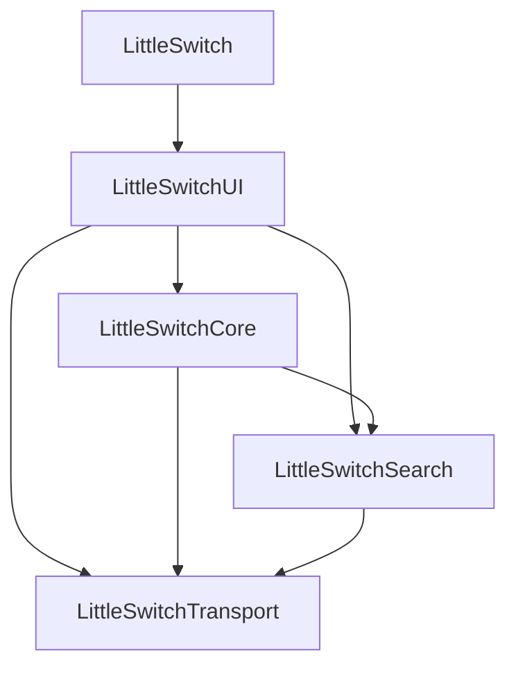

# LittleSwitch Architecture

LittleSwitch is a single native macOS process. `ApplicationCoordinator` is the
actor that owns mutable product state. `AppModel`, isolated on `MainActor`,
exposes its projection to views. Views dispatch intents to the coordinator.
Feature-scoped extensions remain extensions of those same types, with no new
state owner.

## Application domains

| Domain | Responsibility |
| --- | --- |
| Providers | Models, catalogue, HTTP authentication, Messages/Responses/Chat Completions APIs, capabilities, and concurrency limits. |
| Transport | HTTP execution, timeouts and cancellation, URL assembly, SSE framing, and Zstandard decompression. |
| Routing | Mappings between exposed models and destinations, immutable snapshots. |
| Gateway | Local server, admission, endpoints, and orchestration of requests, search, and telemetry. |
| Protocols | Anthropic, OpenAI, and MCP adapters. Explicit wire-format conversion. |
| Search | Common contract, configuration, and Firecrawl, Tavily, Brave, and Exa adapters. |
| Tools | Model tool contracts, deferred discovery, and portable history. |
| Clients | Claude, Claude Code, Codex, and OpenCode profile transactions. |
| Monitoring | Metrics, usage aggregation, OTLP export, and delivery policies. |
| Traffic | Diagnostic records and request attribution. |
| Security | Secret accounts, injected storage, Keychain adapter, credential scripts, and TLS. |
| Configuration | Persisted formats, atomic writes, product identity, and preferences. |

In `LittleSwitchUI`, `Application` contains lifecycle, coordination, common
presentation, and the settings window. `Features` groups Providers, Search,
Monitoring, Activity, General, and the four clients. `Components` contains
reusable controls and icons. `MenuBar` contains the menu. `Platform` contains
launch-at-login, updates, and process management. Tests follow the owning
domain. Gateway integration tests remain in Gateway even when they exercise a
search provider.

## Compilation boundaries

LittleSwitch extracts two auxiliary targets for dependency isolation. `LittleSwitchTransport` owns outbound HTTP, URL assembly, SSE framing, and Zstandard. It must not depend on Core, Search, SwiftUI, or AppKit. `LittleSwitchSearch` owns the common search contract, configuration, and provider adapters. It depends on Transport, never Core or Keychain. Core consumes both.

The 2026-09-09 dependency analysis produced two extracted targets in the
application package.

`LittleSwitchTransport` isolates AsyncHTTPClient, NIO primitives, and
Zstandard. It knows nothing about providers, the gateway, or product
configuration. `LittleSwitchSearch` uses that transport and receives the
credential explicitly. It does not depend on Core, the Keychain, or gateway
formats. Each target has its own independent tests and explicit SwiftPM
dependencies.

The retained surface has `UpstreamTransport`, `AsyncHTTPTransport`,
`Zstandard`, public search configuration/result values, and already-public
initializers. Internal contracts shared across targets use `package` access:
`EndpointURL`, the decoder and SSE frames, `WebSearchSearching`, options, the
factory, and result validation. Imports are explicit. `ProviderEndpoint` keeps
its methods and public error enum. Its facades translate `EndpointURL` errors
without changing their identity.

Monitoring, Tools, Protocols, Clients, and Security stay in Core. Their
current cross-dependencies do not warrant more targets. Monitoring
consumes usage and concurrency states. Tools and Protocols share tool
representations. Client profiles use configuration and routing. Secret accounts
participate in product composition.

## Service contracts

`WebSearchSearching` represents a search with a query, configuration,
credential, and filters, then returns `WebSearchResult` values. The four
adapters keep their HTTP formats, bounds, and particularities. Conversions to
Anthropic, OpenAI, or MCP belong to Protocols and Gateway.

`ProviderWireProbing` distinguishes endpoint presence from observed capability.
An empty-POST response does not certify model support. The injectable probing
contract keeps three probes, their bounded timeout, cancellation propagation,
and result reuse when the endpoint and credential have not changed. Only the
absence of Responses can populate the capability registry, after a successful
save.

`SecretStore` is the synchronous `Sendable` service for reading, writing, and
deleting. `KeychainSecretStore` is its macOS adapter. `MemorySecretStore` serves
in-memory compositions and tests. `MigratingSecretStore` reads the primary
store, then copies the old secret before deleting the old entry when needed.
Service and account names remain stable. TLS certificate trust keeps its
distinct boundary from textual secrets.

## Repository tooling

The standalone package `tools/Package.swift` produces `littleswitch-tools`.
Its `RepositoryTooling` library contains coverage rules, release, repository
policies, monitoring lab, and diagnostics. Swift Argument Parser is its only
external dependency. It depends on no product target.

Mise pins the Xcode environment, tool versions, and gate ordering. Tooling
caches are separate from application caches. Retained shell scripts orchestrate
Apple tools. Deterministic rules are tested in Swift. Developer tools under
`tools/` are distinct from the model-protocol `Tools` domain.

## Validation

The pre-migration baseline includes 2,199 Swift tests and 102 repository tests.
The coverage gate recursively discovers all production Swift files and requires
exactly 100 percent measured lines, per file and in total. Exclusions are named
and justified, with no blanket exclusion of the new targets. Existing Periphery
exceptions are remapped only when the same symbol changes file or module.

`mise run check` is the full gate.
